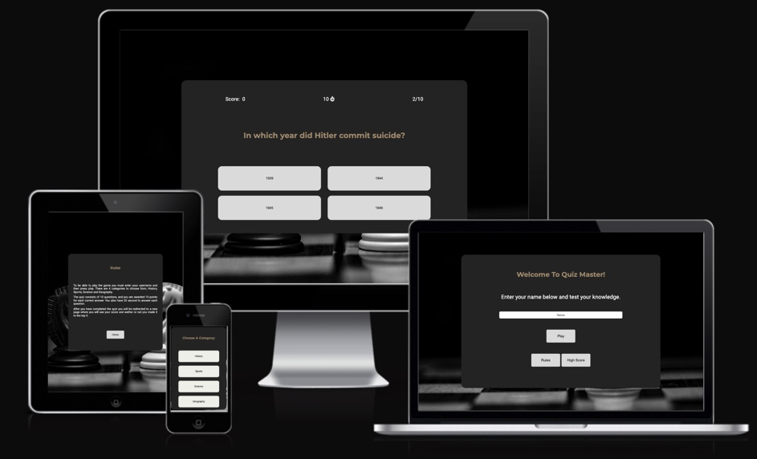
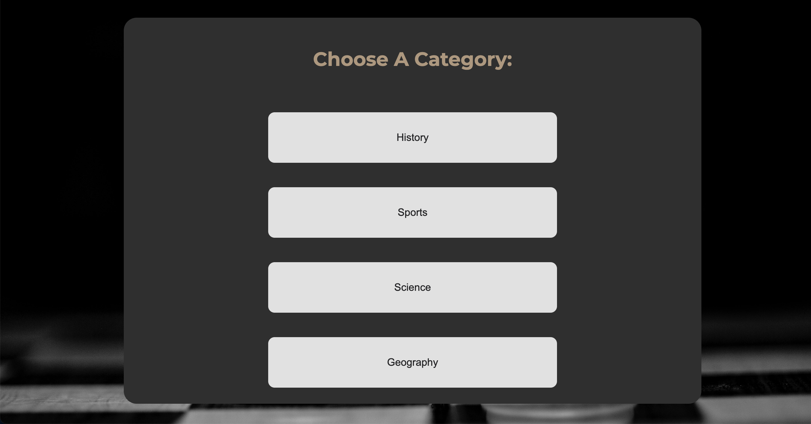
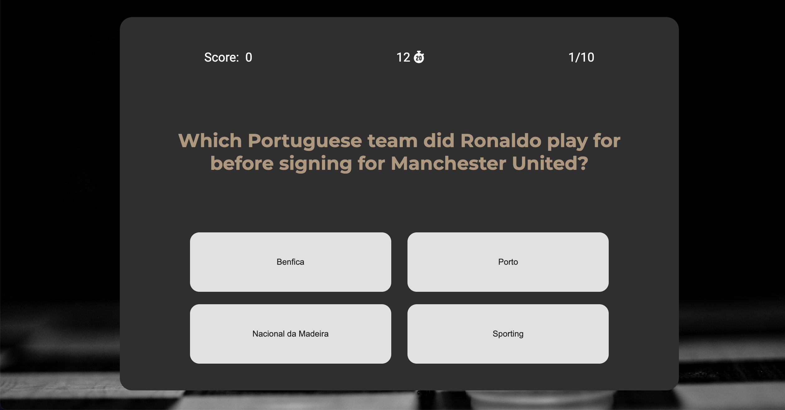

# Quiz Master

Live Website: [Quiz Master website](https://jmanager25.github.io/quiz-master/)

Quiz Master is an online quiz game that allows the players to test their trivial knowledge about a variety of topics. The quiz has 4 categories that the players can choose from. The categories are history, sports, science and geography. Once a categorie is selected the player has to answer 10 questions, displayed one by one. For each question the player has 20 seconds to answer, and they will be awarded 10 points for each correct answer. The Quiz is responsive and can be played in a variety of devices.

## Content

## User Experience

### User Stories

The first time users want a fun game that is easy to navigate and that works on different devices They want to test their knowledge across different topics and learn something along the way.   
The users want to test themselves on a time limit and see their own progress.

## Design
### Colour Scheme

The colour scheme and fonts for this project are based on my previous project. 

This colour pallete is from Barbershop Landing Page by Dmitry Lauretsky

### Typography 

Google Fonts was used for the following fonts:

* Montserrat - for headings

* Roboto - for paragraphs

### Imagery

For the background image I used a chees board image. The main purpose of this image is to give a dark background to the game. 

## Features

The Quiz Master is composed of 6 sections: the landing page, the categories page, the play area, the feedback page, the high score page and the rules page.

### Existing Features
#### The Landing Page

The landing page is the first page that the users see when they enter the website. It welcomes you to the Quiz Master. It has an input field where the user should put the username, a play button, a rules button and the high score button.

#### The Categories Page

The categories page displays the 4 categories that the user can choose from to start the quiz. The categories are: history, sports, science and geography.

#### The Play Area

The Play area is the main area of the quiz, it is where the users test their knowledge. At the top of the page are the score, the timer and the question number. In the middle you have the question and below it the 4 answers that you can choose from. If the selected answer is correct the button turns green and 10 points are added to the score. If it is wrong, the button turns red. If the timer reaches 0, it moves on to the next question.

#### The Feedback Page

The feedback page is a simple page where the player can see his/her total score. There is a play again button that leads the player to the landing.

#### The Rules Page

The rules page contains the rules of the game and a button to return to the landing page.

#### The High Score Page

The high score page is where the player can see the 5 highest scores. There is also a button to return to the landing page.

### Future Features

Future implementations are:
* Two more categories would be added: art/literature and music/cinema.
* Every category has its own background, related to the category.
* A positive sound for the right answer and a sad sound for the wrong one. The player could change the volume or turn it off. 
* When the wrong answer is chosen, the right answer will turn green. So that the player gets the chance to learn what the right answer is. 
* A high score per category. 
* Add more questions to every catgory. So that frequent players still get diverse questions.

## Technologies Used 

## Testing 

## Deployment & Local Development

## Credits
### Content 

### Media 

### Code

## Acknowledgements

